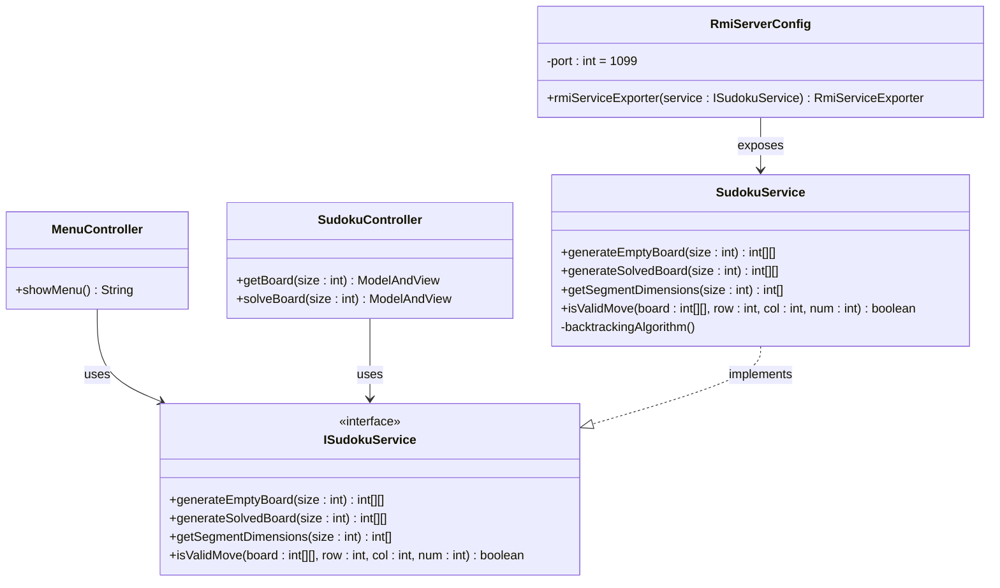

# Sudoku

Este proyecto es una **aplicación web de Sudoku** desarrollada con **Spring Boot** y **Thymeleaf**.  

Incluye:  
- Controladores MVC  
- Servicio de Sudoku con backtracking  
- Exposición vía RMI  
- Vistas dinámicas con HTML + CSS  
- Configuración con `application.yml`  

---

## Arquitectura General

El siguiente diagrama muestra la arquitectura de la aplicación, incluyendo frontend, backend, recursos estáticos y cliente externo vía RMI:

## Diagrama de clases UML
Este diagrama representa las clases Java principales, sus métodos y relaciones:

